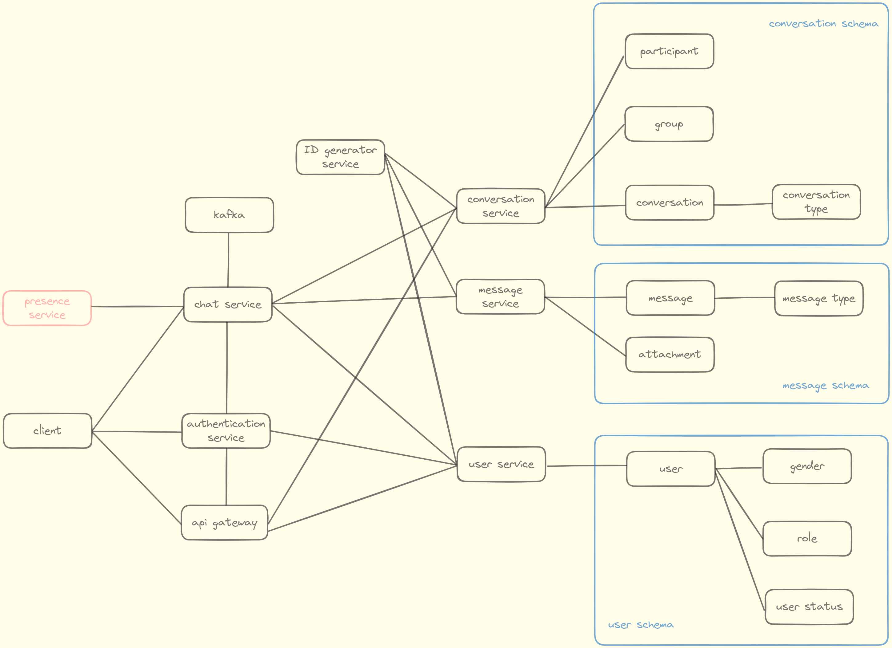

# Chat App

A chat app for chatting, using microservices. 

## Structure

## Features

- User authentication
- Real-time chat
- User management
- Chat management
- Group chat
- Message history

## Related Repositories

- [chat-app-client](https://github.com/huygia12/chat-app-client)
- [chat-app-auth-service](https://github.com/dungtl2003/chat-app-auth-service)
- [chat-app-message-service](https://github.com/dungtl2003/chat-app-message-service)
- [chat-app-user-service](https://github.com/huygia12/chat-app-user-service)
- [chat-app-chat-service](https://github.com/dungtl2003/chat-app-chat-service)
- [snowflake-uuid-service](https://github.com/dungtl2003/snowflake-uuid)
- [chat-app-database](https://github.com/dungtl2003/chat-app-database)
